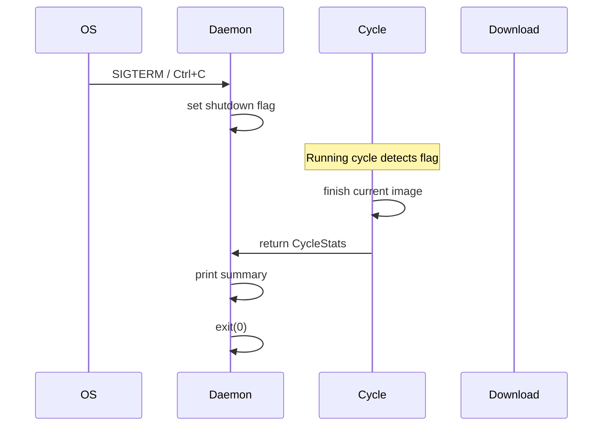
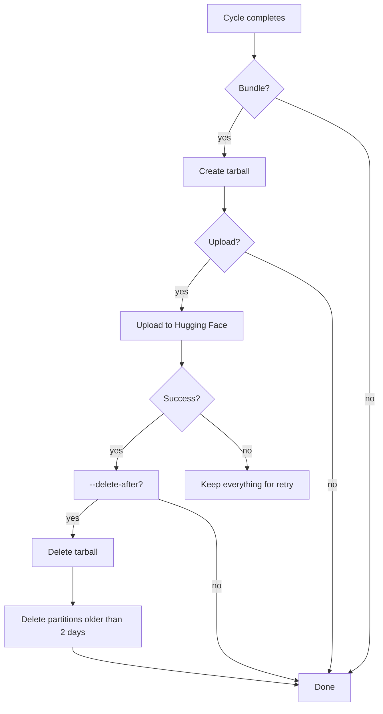

# Deployment guide

---

## Docker

### Build

```bash
docker build -t civistash .
```

The Dockerfile uses a two-stage build:
1. **Stage 1 (build)** — Rust 1.89.0 on Debian Bookworm Slim. Installs
   build dependencies (`cmake`, `pkg-config`, `ca-certificates` for HTTPS
   crate downloads), pre-fetches dependencies for layer caching, then
   compiles with `--release` (LTO, single codegen unit, stripped).
2. **Stage 2 (runtime)** — Minimal Debian Bookworm Slim. Copies only the
   binary. No token placeholders — supply tokens at runtime.

### Run

```bash
mkdir -p stash

docker run -d \
  --name civistash \
  --restart unless-stopped \
  -e CIVITAI_TOKEN="eyJ…" \
  -e HUGGINGFACE_TOKEN="hf_…" \
  -e RUST_LOG=info \
  -v "$(pwd)/stash:/stash" \
  civistash \
  --daemon \
  --period Day \
  --nsfw-level none,soft,mature,x \
  --all-types \
  --bundle \
  --limit 200
```

- The binary reads `CIVITAI_TOKEN` and `HUGGINGFACE_TOKEN` directly via
  clap's `env` derive — no shell forwarding needed inside the container.
- `RUST_LOG=info` is the default but explicit for visibility.
- Mount `./stash:/stash` so downloads, sidecars, and bundles survive
  container restarts.

### Pre-built image

A pre-built image is published at:

```
ghcr.io/hyphonical/civistash:latest
```

---

## Docker Compose

The repository includes a `docker-compose.yml` configured for daily archival.

```bash
echo "CIVITAI_TOKEN=eyJ…" > .env
# Optional: only needed with --upload-hf
echo "HUGGINGFACE_TOKEN=hf_…" >> .env
docker compose up -d
```

The compose file:
- Fails loudly if `CIVITAI_TOKEN` is unset (uses `${CIVITAI_TOKEN:?…}`).
- Makes `HUGGINGFACE_TOKEN` optional.
- Mounts `./stash:/stash` for persistence.
- Runs `--daemon --period Day` with all NSFW levels and all media types.
- Commented-out lines for `--upload-hf` and `--delete-after` — uncomment
  and replace the repo ID when ready.

### Enabling Hugging Face upload

Uncomment and edit these lines in `docker-compose.yml`:

```yaml
command: >
  …
  --upload-hf your-org/your-dataset
  --delete-after
```

Set `HUGGINGFACE_TOKEN` in your `.env`:

```
HUGGINGFACE_TOKEN=hf_…
```

With `--delete-after`, local files are removed after a successful upload.
The Hugging Face dataset repo becomes the canonical store. This is ideal
for VPS instances with limited disk space.

---

## Daemon lifecycle

Running with `--daemon`:

1. The daemon enters a loop.
2. Each iteration runs a full cycle: fetch → filter → download → sidecar →
   bundle → upload → (optional) clean.
3. After a cycle, it prints the summary and sleeps for the period's
   cooldown duration.
4. Any error in a cycle (API failure, download failure, upload failure) is
   logged. The daemon **does not exit** on cycle errors — it sleeps and
   retries in the next iteration.
5. The exception: `--daemon` + `--period AllTime` is rejected at startup
   because there is no sensible cooldown.

### Graceful shutdown



- `SIGTERM` or `Ctrl+C` sets an atomic flag.
- The flag is checked between each image download — the current in-flight
  HTTP request is **not** aborted.
- If a second signal arrives while still processing, the process exits
  immediately.
- On clean shutdown: the daemon prints the partial cycle summary (even
  with 0 downloads), then exits with code 0.
- **Daemon waits for the current cycle to finish** — on `--period Day`
  with 200 images downloading at varied speeds, shutdown may take minutes.

### Cleanup (`--delete-after`)



Key behaviors:
- **Tarball deleted immediately** after a successful upload — Hugging Face
  has the bytes.
- **Partitions older than 2 days** are removed. This keeps `today` and
  `yesterday`, matching the rolling 24-hour window CivitAI uses for
  `period=Day`.
- **Everything preserved on upload failure** — the next cycle retries
  with the same partition and tarball.
- **5 GB disk warning** — the cycle prints a warning at startup if the
  stash directory exceeds 5 GB, suggesting `--delete-after`.

---

## Systemd

For running civistash as a systemd service (bare-metal or VPS):

```ini
# /etc/systemd/system/civistash.service
[Unit]
Description=Civistash CivitAI archiver daemon
After=network-online.target
Wants=network-online.target

[Service]
Type=simple
User=civistash
WorkingDirectory=/var/lib/civistash
Environment=RUST_LOG=info
EnvironmentFile=/etc/civistash/env
ExecStart=/usr/local/bin/civistash \
  --daemon \
  --period Day \
  --nsfw-level none,soft,mature,x \
  --all-types \
  --bundle \
  --limit 200 \
  --output-dir /var/lib/civistash/stash
Restart=on-failure
RestartSec=30
KillSignal=SIGTERM
TimeoutStopSec=120

[Install]
WantedBy=multi-user.target
```

Set up:

```bash
sudo useradd -r -m -d /var/lib/civistash civistash
sudo mkdir -p /etc/civistash
echo 'CIVITAI_TOKEN=eyJ…' | sudo tee /etc/civistash/env
sudo chmod 600 /etc/civistash/env
sudo cp target/release/civistash /usr/local/bin/
sudo systemctl daemon-reload
sudo systemctl enable --now civistash
```

- `KillSignal=SIGTERM` triggers the graceful shutdown path.
- `TimeoutStopSec=120` gives the daemon up to 2 minutes to finish the
  current download before systemd forces a kill.
- With `period=Day`, a cycle runs every 24 hours. The daemon sleeps
  between cycles — CPU usage is near zero outside the fetch/download phase.
- For 200 images, a cycle typically completes in minutes. Adjust
  `TimeoutStopSec` upward if you run `period=Week` with high limits.

---

## Cron (one-shot mode)

For simple scheduled runs without the daemon:

```cron
# Daily at 02:00 UTC
0 2 * * * CIVITAI_TOKEN="eyJ…" HUGGINGFACE_TOKEN="hf_…" /usr/local/bin/civistash --period Day --limit 200 --bundle --upload-hf my-org/dataset --delete-after >> /var/log/civistash.log 2>&1
```

Cron's environment is minimal — tokens must be passed directly or sourced
from a file:

```cron
0 2 * * * . /etc/civistash/env && /usr/local/bin/civistash --period Day --limit 200 --bundle --upload-hf my-org/dataset --delete-after >> /var/log/civistash.log 2>&1
```

Cron is simpler than the daemon but has no overlapping-cycle
protection — if a run takes longer than 24 hours, the next cron trigger
starts a second instance. Stick to `--period Day` with reasonable limits
(say, ≤ 500) unless you coordinate with a wrapper script.
